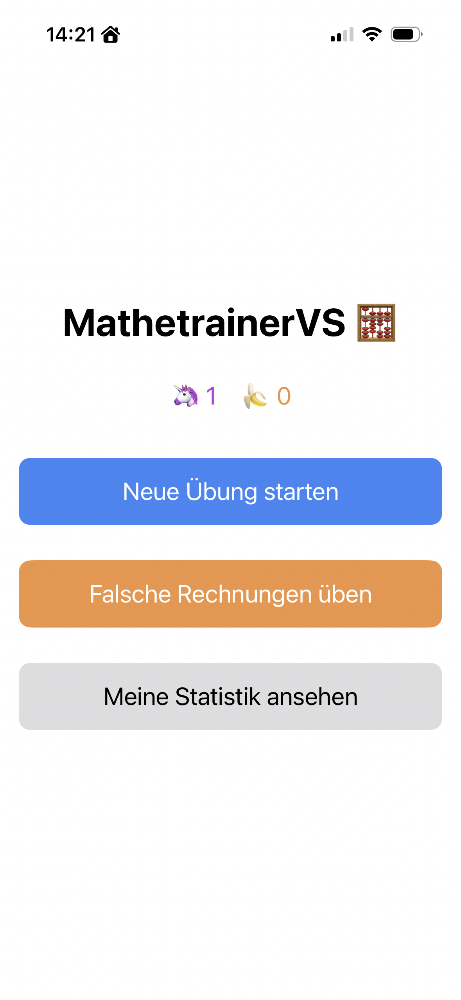

# MathetrainerVS 🧮

[](https://github.com/bausi2k/MathetrainerVS/releases)
[](https://github.com/bausi2k/MathetrainerVS/commits/main)

## Projektbeschreibung

MathetrainerVS ist eine einfache, interaktive Lern-App für iOS, die Kindern (und Erwachsenen\!) hilft, ihre mathematischen Fähigkeiten in den Grundrechenarten zu verbessern. Die App konzentriert sich auf Addition, Subtraktion, Multiplikation und Division und bietet anpassbare Übungseinheiten sowie motivierende Gamification-Elemente.

Ziel ist es, das Kopfrechnen zu fördern und den Spaß am Lernen durch spielerische Belohnungen (Einhörner und Bananen) zu steigitteln.

## Funktionen

* **Anpassbare Übungen:** Wähle zwischen Addition, Subtraktion, Multiplikation und Division.
* **Schwierigkeitsgrade:** Festlegung der Anzahl der Fragen (z.B. 1-10 für Multiplikatoren/Divisoren) und optional drei Operanden für Addition/Subtraktion.
* **Ganzzahlige Division:** Alle Divisionsaufgaben sind so konzipiert, dass sie immer ein ganzzahliges Ergebnis ohne Rest liefern.
* **Fokus auf Fehler:** Möglichkeit, spezielle Übungseinheiten nur mit zuvor falsch beantworteten Fragen zu erstellen oder diese in normale Sessions einzustreuen.
* **Gamification:** Sammle Einhörner für richtige Antworten und handle mit Bananen, um den Fortschritt spielerisch zu verfolgen.
* **Timer-Option:** Optionaler Timer für zeitgesteuerte Übungen, um die Schnelligkeit zu trainieren.
* **Statistik:** Verfolge den Fortschritt über absolvierte Übungen, gestellte Fragen und die durchschnittliche Richtigkeit.
* **Session-Abbruch:** Eine laufende Session kann jederzeit abgebrochen werden, der Fortschritt bis dahin wird gewertet.
* **Klare Oberfläche:** Einfache und intuitive Benutzeroberfläche, optimiert für mobiles Lernen.

## Screenshots

Hier ist ein Blick auf die Startansicht und die Gamification-Elemente:

 


## Installation und Nutzung

Die MathetrainerVS App ist ein natives iOS-Projekt. Um es zu kompilieren und auszuführen:

1.  **Clone das Repository:**
    ```bash
    git clone [https://github.com/bausi2k/MathetrainerVS.git](https://github.com/bausi2k/MathetrainerVS.git)
    ```
2.  **Öffne das Projekt:** Navigiere zum geklonten Verzeichnis und öffne `MathetrainerVS.xcodeproj` in Xcode.
3.  **Wähle ein Zielgerät:** Wähle einen Simulator oder ein angeschlossenes iOS-Gerät.
4.  **Starte die App:** Klicke auf den "Run"-Button (▶️) in Xcode.

## Aktuelle Version

Die aktuelle stabile Version ist [v1.0](https://github.com/bausi2k/MathetrainerVS/releases/tag/v1.0).

## Zukünftige Pläne (Roadmap)

* **Multiuser-Support:** Ermöglichen, dass mehrere Kinder die App auf einem Gerät nutzen können, mit individuellen Fortschritten und Statistiken.
* **Weitere Schwierigkeitsgrade:** Erweiterung der Zahlenbereiche und Operanden.
* **Anpassbare Themene:** Visuelle Anpassung der App.
* **Soundeffekte:** Audio-Feedback für richtige/falsche Antworten.

## Beitrag

Beiträge, Fehlerberichte und Feature-Vorschläge sind herzlich willkommen\! Bitte öffne ein Issue oder erstelle einen Pull Request auf GitHub.

## Lizenz

Dieses Projekt ist unter der [MIT Lizenz](LICENSE) lizenziert.